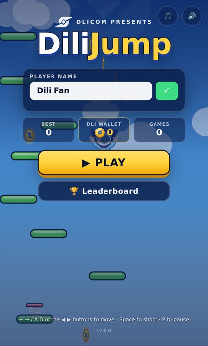
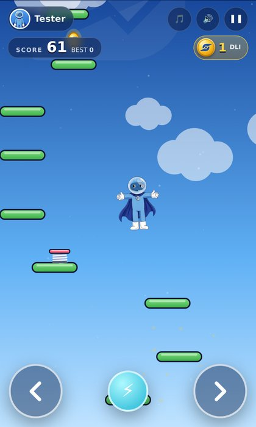
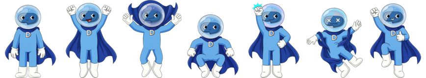

<div align="center">


# DiliJump

**A Doodle Jump–style 2D web game starring the Dlicom mascot.**
Jump from platform to platform, grab **DLI coins**, dodge glitch bugs and climb the leaderboard.

[](https://github.com/levsage/DiliJump/actions/workflows/ci.yml)


**▶ Play now: [dili-jump.vercel.app](https://dili-jump.vercel.app)** · mirror: [levsage.github.io/DiliJump](https://levsage.github.io/DiliJump/)


&nbsp;


</div>

---

## ✨ Features

| Feature                | Description                                                                                                                                       |
| ---------------------- | ------------------------------------------------------------------------------------------------------------------------------------------------- |
| 🎮 **Single player**   | Endless vertical climb with procedurally generated, always-beatable levels                                                                        |
| 🦸 **Animated mascot** | Generated **3-pose jump** (squat · rise · fall) and **8-frame spring super-jump** (superhero flight, somersault), plus shoot / hurt / cheer poses |
| 🏷️ **Custom name bar** | Pick your player name; shown in the in-game HUD and on the leaderboard                                                                            |
| 🔢 **Scoreboard**      | Live score + personal best in the HUD, and a detailed end-of-run scoreboard                                                                       |
| ⭐ **Player level**    | Every point you score is XP — all runs add up. Level shown next to your name on the leaderboard, XP bar in the menu, LEVEL UP! on game over       |
| 🏆 **Leaderboard**     | Live global leaderboard (Supabase, realtime) — each player's best score, medals, dates and coins; offline fallback                                |
| 🪙 **DLI coin bar**    | Collect coins stamped with the Dlicom logo; run total in the HUD and a persistent DLI wallet                                                      |
| 🧱 **Side walls**      | Solid glowing walls on both sides: the mascot can't slip off one edge and appear on the other                                                     |
| 🧩 **Platforms**       | Normal, moving, breaking and vanishing platforms plus bouncy "boing" springs                                                                      |
| 👾 **Enemies**         | Glitch bugs — stomp them or shoot them with energy bolts                                                                                          |
| 📱 **Easy controls**   | On-screen ◀ ▶ buttons (touch or mouse, slide between them), keyboard, installable PWA                                                             |
| 🎵 **Music & sound**   | Original chiptune soundtrack that gets fuller as you climb + sound effects, all synthesised live (no audio files)                                 |
| 📶 **Works offline**   | Installable PWA with a service worker: loads instantly after the first visit and plays with no connection                                         |
| 🔐 **No login**        | Your name, coins and player id live in the browser; scores are stored in Supabase                                                                 |

## 🕹️ Controls

| Action | Keyboard            | Touch / mouse                                       |
| ------ | ------------------- | --------------------------------------------------- |
| Move   | `←` `→` or `A` `D`  | Hold the ◀ ▶ buttons (or either half of the screen) |
| Shoot  | `Space`, `↑` or `W` | ⚡ button                                           |
| Pause  | `P` or `Esc`        | ❚❚ button                                           |
| Music  |                     | 🎵 button (menu and in-game); 🔊 mutes everything   |

## 🚀 Getting started

Requires **Node.js ≥ 22** (see `.nvmrc`).

```bash
git clone https://github.com/levsage/DiliJump.git
cd DiliJump
npm install
npm run dev        # http://localhost:5173
```

### Deploy (Vercel)

Import the repo at <https://vercel.com/new>, add `VITE_SUPABASE_URL` and `VITE_SUPABASE_PUBLISHABLE_KEY` as environment variables, and deploy. Settings come from `vercel.json`.

Every production build is hardened automatically: Content Security Policy (header on Vercel, `<meta>` everywhere), service worker for offline play, no source maps. See **[Production](docs/ARCHITECTURE.md#production-build)**.

### Live leaderboard (optional)

```bash
cp .env.example .env.local   # add your Supabase URL + publishable key
```

Full guide: **[docs/SUPABASE.md](docs/SUPABASE.md)**. Without these values the game uses an offline leaderboard.

### Scripts

| Command            | What it does                                              |
| ------------------ | --------------------------------------------------------- |
| `npm run dev`      | Start the Vite dev server with hot reload                 |
| `npm run build`    | Production build into `dist/`                             |
| `npm run preview`  | Serve the production build locally                        |
| `npm test`         | Run unit tests (Vitest)                                   |
| `npm run lint`     | Lint with ESLint                                          |
| `npm run format`   | Format with Prettier                                      |
| `npm run check`    | Lint + format check + tests + build (same as CI)          |
| `npm run test:e2e` | Playwright smoke tests against the production build       |
| `npm run sprites`  | Re-process pose renders in `art/poses/` into game sprites |
| `npm run og-image` | Re-render the social preview card `public/og-image.jpg`   |

## 🗂️ Project structure

```
DiliJump/
├── .github/                 # CI workflows, issue & PR templates
├── art/                     # Source artwork (not shipped)
│   ├── source/              # Original mascot reference & helmet highlight layer
│   ├── poses/               # Generated pose renders (chroma-key backgrounds)
│   └── sheets/              # Generated animation sheets (jump, spring)
├── docs/                    # Architecture, gameplay, branching, images
├── public/                  # Static files copied as-is into the build
│   ├── assets/brand/        # Dlicom logo, DLI coin, favicons, app icons
│   ├── assets/sprites/      # Mascot poses + animation atlases (WebP)
│   ├── og-image.jpg         # Social link preview card
│   ├── 404.html
│   └── manifest.webmanifest
├── supabase/                # Leaderboard SQL migrations + SQL tests
├── src/
│   ├── config/              # constants.js (all tuning), assets.js (manifest)
│   ├── core/                # Game (state machine), World (simulation), GameLoop, Input, EventBus, AssetLoader
│   ├── entities/            # Player, Platform, Coin, Spring, Monster, Projectile, Particle
│   ├── systems/             # LevelGenerator, Difficulty, Collision, Camera, AudioManager
│   ├── rendering/           # Renderer, Background, brand (logo paths), palette
│   ├── services/            # Storage, Profile, Wallet, Settings, PlayerIdentity, supabaseClient, leaderboard/
│   ├── ui/                  # UIManager, HUD, screens/
│   ├── styles/              # main.css
│   └── main.js              # Composition root
├── tests/                   # Vitest unit tests (+ e2e/ Playwright smoke tests)
├── tools/                   # Asset pipeline (Python), Vite plugins (CSP, service worker), OG card
└── index.html
```

More detail in [`docs/ARCHITECTURE.md`](docs/ARCHITECTURE.md), [`docs/GAMEPLAY.md`](docs/GAMEPLAY.md) and [`docs/SUPABASE.md`](docs/SUPABASE.md).

## 🌿 Branches

| Branch | Purpose                                                                       |
| ------ | ----------------------------------------------------------------------------- |
| `main` | Stable, released code. Deployed to Vercel (production) and GitHub Pages.      |
| `beta` | Integration / pre-release testing (Vercel preview). Features land here first. |

See [`docs/BRANCHING.md`](docs/BRANCHING.md) for the full workflow.

## 🎨 Assets

- **Mascot** — based on the official Dlicom mascot artwork. Poses were AI-generated from the reference and processed with [`tools/process_sprites.py`](tools/process_sprites.py) (chroma-key, despill, uniform scale, bottom-centre anchor).
- **Logo** — the official Dlicom logo (`public/assets/brand/dlicom-logo.svg`). It is also drawn as vector paths on every DLI coin (`src/rendering/brand.js`).

<p align="center"></p>

## 📄 License

Code is released under the [MIT License](LICENSE). The Dlicom name, logo and mascot artwork are trademarks of their respective owners and are **not** covered by the MIT license.
